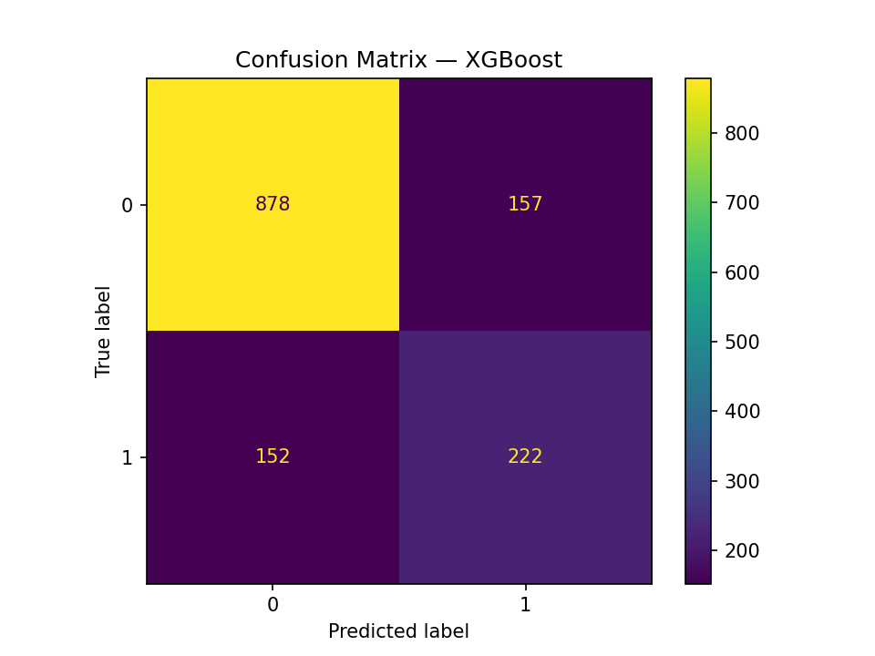
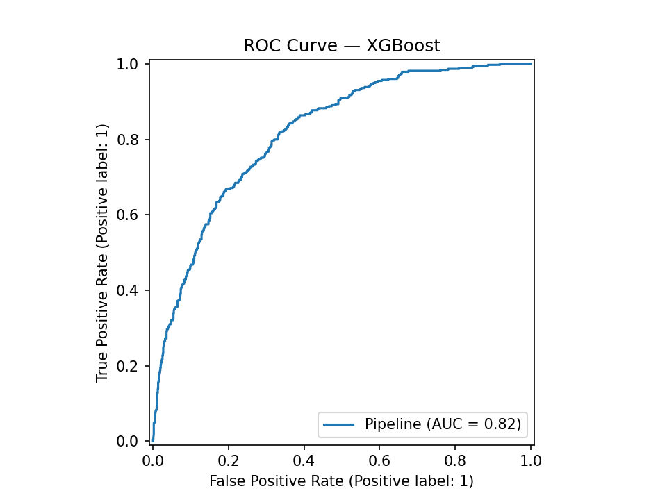

# Customer Churn Prediction

An end-to-end machine learning project for predicting customer churn using the IBM Telco Customer Churn dataset.

## Project Overview

Customer churn prediction helps businesses identify customers who are likely to discontinue their services.

This project builds and compares multiple machine learning models while addressing class imbalance using SMOTE.

## Dataset

IBM Telco Customer Churn Dataset

The dataset contains customer information including:

- Demographics
- Account information
- Services subscribed
- Contract details
- Monthly charges
- Total charges
- Churn status

## Machine Learning Pipeline

1. Data loading and inspection
2. Data cleaning
3. Missing-value handling
4. Numerical feature scaling
5. Categorical feature one-hot encoding
6. Train-test split
7. Class imbalance handling using SMOTE
8. Model training
9. Model comparison
10. Evaluation using classification metrics

## Models Compared

- Logistic Regression
- Random Forest
- XGBoost

## Evaluation Metrics

Models were evaluated using:

- Precision
- Recall
- F1-score
- ROC-AUC

Special attention was given to recall and F1-score for the churn class because failing to identify an actual churner can be more costly to a business than generating a false positive.

## Handling Class Imbalance

The dataset contains significantly more non-churning customers than churning customers.

SMOTE (Synthetic Minority Over-sampling Technique) was applied only to the training pipeline to reduce the impact of class imbalance.

## Confusion Matrix

## ROC Curve

## Technologies

- Python
- Pandas
- Scikit-learn
- Imbalanced-learn
- XGBoost
- Matplotlib

## Key Learning

This project demonstrates why accuracy alone can be misleading for imbalanced classification problems. Precision, recall, F1-score, and ROC-AUC provide a more meaningful evaluation of churn prediction performance.# customer-churn-prediction
